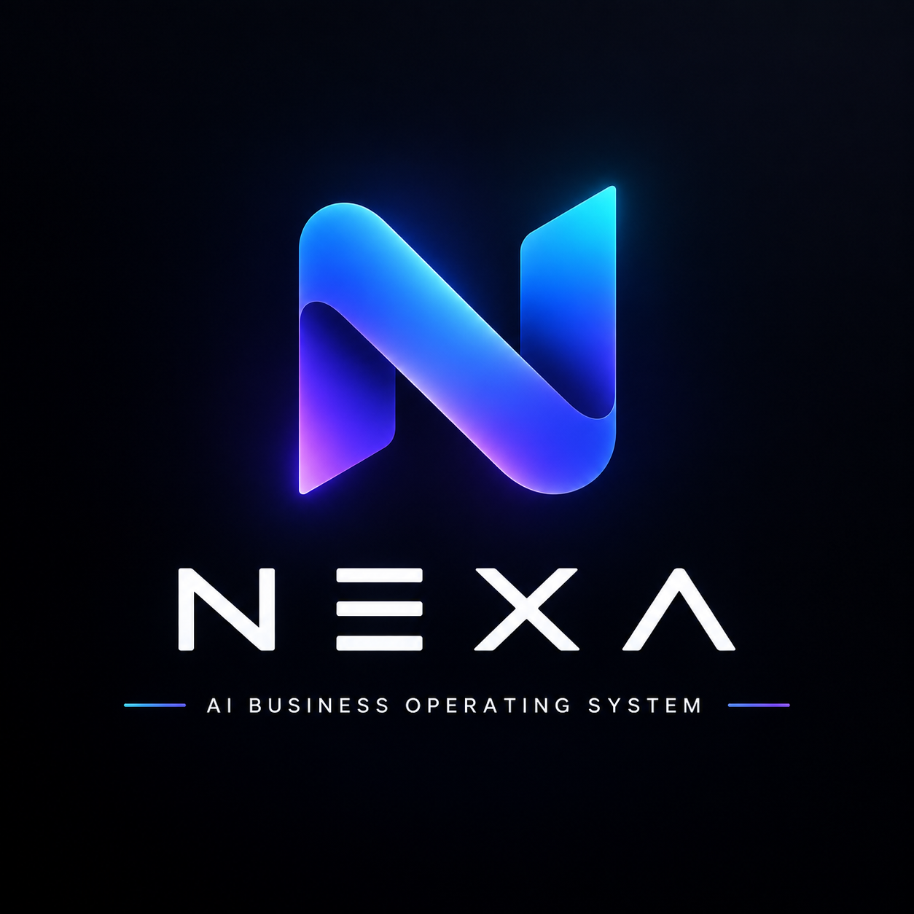

# NEXA

  

<h2 align="center">NEXA — AI Business Operating System</h2>

  Intelligent tools for running, automating, and scaling a modern business.

---

## Brand

**NEXA** is the core product identity.

The logo asset is stored in the repository as `nexa-logo.png`.

## Vision

NEXA is being built as an AI-powered Business Operating System that brings business workflows, intelligence, automation, and decision support into one place.

## Project Status

🚀 Early development

This repository is the foundation for the NEXA product.

## Roadmap

- AI business assistant
- Business dashboard
- Workflow automation
- Intelligent document handling
- Analytics and insights
- Integrations
- Mobile-friendly experience

---

**NEXA — AI Business Operating System**
